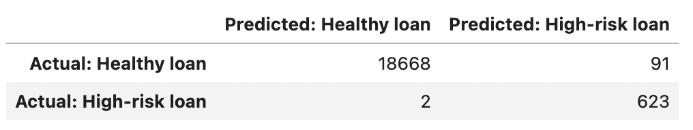
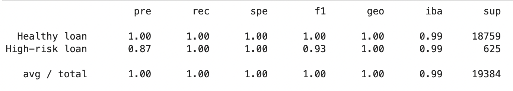

# Report

## Overview of the Analysis

The Purpose of this analysis is to identify which Model is better suited to accurately predict the Status (Healthy 
or Risky) for Loan Applications based on features such as the Loan Size, Interest Rate, Borrower Income, Debt to Income 
ratio, Number of Accounts, Derogatory Marks and Total Debt.

The data to be used for this analysis is stored in the [lending_data.csv](Resources/lending_data.csv) file. This data 
doesn't need to be encoded as it is all numerical.

After importing the csv file into a Pandas DataFrame, using the `value_counts` function exposes that the data available 
for predictions has a lot more occurrences of Healthy Loans, where `loan_status = 0`, compared to the number of 
transactions classified as High-risk Loans, where `loan_status = 1`. This means the data is imbalanced, favouring the 
identification of "Healthy Loans".

## Stages of the Machine Learning process
1. The data from the Pandas DataFrame is split into `X` and `y`. Here `X` represents the "features" columns, in this 
case the Loan Size, Interest Rate, Borrower Income, Debt to Income ratio, Number of Accounts, Derogatory Marks and Total 
Debt; while `y` is the "target" or the data we are trying to predict, in this case the Loan Status column.
2. The `train_test_split` function from Scikit learn is used to further split the data into training and testing datasets:
X_train, X_test, y_train, y_test.
3. Then, a new instance of the Model that will be used for predictions is created. In this case, we are using **Logistic 
Regression** from [Scikit learn](https://scikit-learn.org/stable/modules/linear_model.html#logistic-regression), which is 
a linear model for classification where the probabilities describing the possible outcomes of a single trial are modeled 
using a [logistic function](https://en.wikipedia.org/wiki/Logistic_function).
4. Next, using our Model we fit the training data (X_train, y_train).
5. Finally, we make predictions using the testing data (X_test).

## Models to be evaluated
Two models were created for predictions, both as an instance of the **Logistic Regression** Model. However, "Model 1" is
trained using the original data with imbalanced classes, while "Model 2" is trained on resampled data. The data for Model
2 is resampled using the over sampling technique [Random Over Sampler](https://imbalanced-learn.org/stable/references/generated/imblearn.over_sampling.RandomOverSampler.html), 
thus giving the Minority Class (High-risk loans) a greater-than-random chance.

## Results

### Machine Learning Model 1: Logistic Regression with Original Data

Model 1 Confusion Matrix

Model 1 Classification Report Imbalanced

* **Balanced Accuracy Score** = `0.9442`
* **Precision Score** 
  * Healthy loan = `1.00`
  * High-risk loan = `0.87`
  * Average/Total = `0.99`
* **Recall Score** 
  * Healthy loan = `1.00`
  * High-risk loan = `0.89`
  * Average/Total = `0.99`

The *Balanced Accuracy Score* for Model 1 is `0.9442`. This score indicates approximately `94.42%` of the transactions 
in the test data were accurately categorised by the model. On the other hand, the *value_counts* suggest that there 
were very few "High-risk loans" in the data, thus the model could have had high accuracy by predicting all transactions 
are "Healthy loans". This demonstrates the sample data is imbalanced.

* *False Positives*: Number of transactions incorrectly identified as High-risk loans = 80
* *False Negatives*: Number of transactions incorrectly identified as Healthy loans = 67

### Machine Learning Model 2: Logistic Regression with Resampled Training Data

Model 2 Confusion Matrix

Model 2 Classification Report Imbalanced

* **Balanced Accuracy Score** = `0.9959`
* **Precision Score** 
  * Healthy loan = `1.00`
  * High-risk loan = `0.87`
  * Average/Total = `1.00`
* **Recall Score** 
  * Healthy loan = `1.00`
  * High-risk loan = `1.00`
  * Average/Total = `1.00`

* *False Positives*: Number of transactions incorrectly identified as High-risk loans = 91
* *False Negatives*: Number of transactions incorrectly identified as Healthy loans = 2

## Summary

When looking at the results of **Model 1**, given we are dealing with imbalanced classes where the majority of sample 
transactions are for the "Healthy loans" category, the Logistic Regression model is predicting Healthy loans with 
approximately 100% precision, as expected. However, the precision for High-risk loans is approximately 87%, generating a 
higher percentage of False Negatives, as demonstrated by a recall score of `0.89`. The *Balanced accuracy* score is 
approximately `94%` overall.

In contrast, after resampling the training data to obtain classes with even number of occurrences, **Model 2** is performing
better in terms of *Balanced accuracy* with an overall score of approximately `99%`, and a Recall score of `100%` for the
High-risk loan category. This means the number of False Negatives is much lower compared to Model 1. However, the Precision
remains almost unchanged, except for the "Average/Total" where the score went up to `100%`.

Based on these results, and considering that the implications of incorrectly identifying a High-risk loan as "Healthy" 
can have worse repercussions for a Lending Services company, I recommend using Model 2. However, given the Precision is
not yet sufficiently high for High-risk loans, it would be beneficial to start by running a pilot with new data to 
assess the model's reliability, as ideally we need more occurrences of High-risk loans to train our Model.