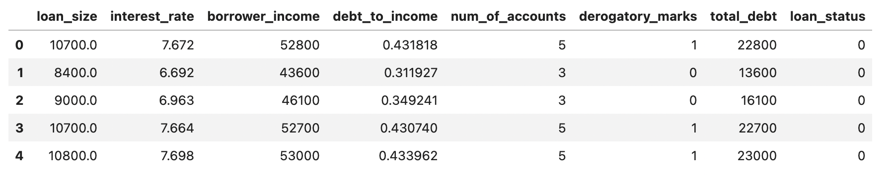
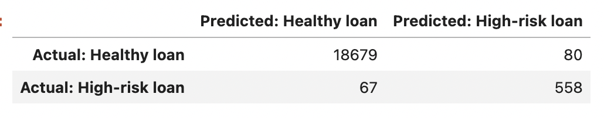
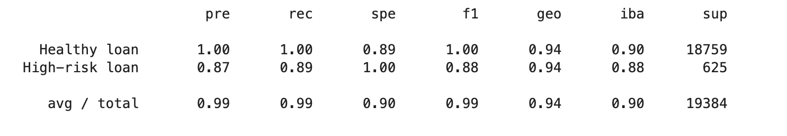

# Report

## Overview of the Analysis

The Purpose of this analysis is to identify which Model is better suited to accurately predict the Status (Healthy 
or Risky) for Loan Applications based on features such as the Loan Size, Interest Rate, Borrower Income, Debt to Income 
ratio, Number of Accounts, Derogatory Marks and Total Debt.

The data to be used for this analysis is stored in the [lending_data.csv](Resources/lending_data.csv) file. 

After importing the csv file into a Pandas DataFrame, using the `value_counts` function exposes that the data available 
for predictions has a lot more occurrences of Healthy Loans, where `loan_status = 0`, compared to the number of 
transactions classified as High-risk Loans, where `loan_status = 1`. This means the data is imbalanced, favouring the 
identification of "Healthy Loans".

* Describe the stages of the machine learning process you went through as part of this analysis.
* Briefly touch on any methods you used (e.g., `LogisticRegression`, or any resampling method).
> The first Model to perform the predictions is created using LogisticRegression...

## Results

### Machine Learning Model 1: Logistic Regression with Original Data

Model 1 Confusion Matrix

Model 1 Classification Report Imbalanced

* **Balanced Accuracy Score** = `0.9442`
* **Precision Score** Healthy loan = `1.00` | High-risk loan = `0.87` | Average/Total = `0.99`
* **Recall Score** Healthy loan = `1.00` | High-risk loan = `0.89` | Average/Total = `0.99`

The *Balanced Accuracy Score* for Model 1 is `0.9442`. This score indicates approximately `94.42%` of the transactions 
in the test data were accurately categorised by the model. On the other hand, the *value_counts* suggest that there 
were very few "High-risk loans" in the data, thus the model could have had high accuracy by predicting all transactions 
are "Healthy loans". This demonstrates the sample data is imbalanced.

*False Positives*: Number of transactions wrongly identified as High Risk = 80
*False Negatives*: Number of transactions wrongly identified as Healthy Loans (Low Risk) = 67

### Machine Learning Model 2: Logistic Regression with Resampled Training Data
  * Description of Model 2 Accuracy, Precision, and Recall scores.

## Summary

Summarize the results of the machine learning models, and include a recommendation on the model to use, if any. For example:
* Which one seems to perform best? How do you know it performs best?
* Does performance depend on the problem we are trying to solve? (For example, is it more important to predict the `1`'s, or predict the `0`'s? )

If you do not recommend any of the models, please justify your reasoning.

> Given we are dealing with "Imbalanced Class"...
> The Balanced accuracy score is approximately 94% overall. As expected, given we are dealing with imbalanced data where 
> the majority of sample transactions are for Healthy loans, the Logistic Regression model is predicting Healthy loans 
> with approximately 100% precision. However, the precision for High-risk loans is approximately 87%, generating a higher 
> percentage of False Negatives.